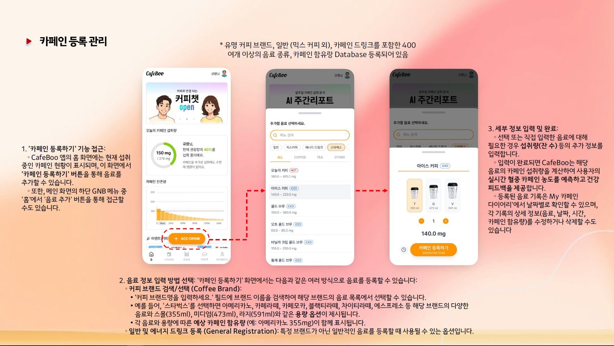
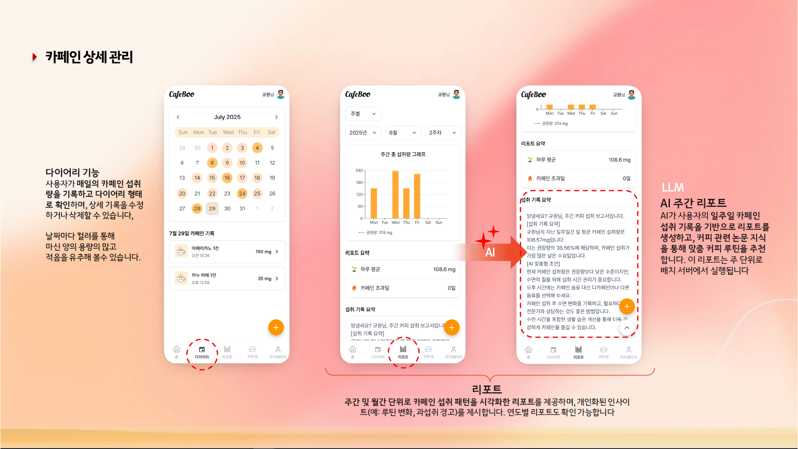
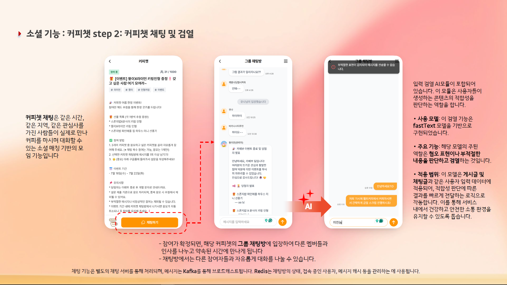

  
  

 

<section aria-labelledby="project-details">
  <h2 id="project-details">📌 Project Details</h2>
  
개인이 등록한 카페인 섭취 내역을 바탕으로 그에 대한 AI 생성 평가 리포트를 제공하는 헬스케어 서비스

  
 Wiki : <a href="https://github.com/100-hours-a-week/13-Cafeboo-wiki/wiki"> Wiki로 이동 </a> 

  
 GitHub Repository : <a href="https://github.com/100-hours-a-week/13-Cafeboo-be"> Repository로 이동 </a> 

</section>

 

<section aria-labelledby="roles">
  <h2 id="roles">👨‍💻 My Roles &amp; Responsibilities</h2>
  <ul>
    <li><u><strong>기여도 60%</strong></u></li>
    <li>STOMP(WebSocket) 기반 채팅 기능에 실시간성을 더하기 위해 <strong>Redis Stream</strong>을 메시지 큐로 활용, 이벤트 기반 아키텍처 구현</li>
    <li>‘카페인 추적 관리 서비스’ 비즈니스 기획 및 개발</li>
    <li>데이터 정합성 보장을 위한 DB 설계 및 정규화</li>
  </ul>
</section>

 

<section aria-labelledby="tech">
  <h2 id="tech">🛠️ Technologies</h2>
  <ul>
    <li>Java Spring Boot</li>
    <li>MySQL</li>
    <li>Redis, Redis Stream</li>
    <li>Kafka</li>
    <li>StompJS</li>
    <li>JWT</li>
  </ul>
</section>

 

<section aria-labelledby="troubleshooting">
  <h2 id="troubleshooting"> Troubleshooting</h2>
  
 프로젝트 설계 및 트러블 슈팅 기록은 <a href="https://www.notion.so/1e2b7198b66480a58cc1f30845cb9cee?source=copy_link#26eb7198b66480c2b814cb70186ac5a8"><u>여기에</u></a> 기록했습니다. 

</section>

 

<section aria-labelledby="key-features">
  <h2 id="key-features">🚀 Key Features</h2>

  <article aria-labelledby="caffeine-add">
    <h3 id="caffeine-add">🔹 카페인 등록 관리 </h3>
    
 서비스 이용자의 카페인 섭취내역 등록 및 시간대별 카페인 체내 잔존량 그래프 제공 

    
  </article>

   
  

   
  
  <article aria-labelledby="caffeine-management">
    <h3 id="caffeine-management">🔹 카페인 상세 관리 기능</h3>
    
일자별 카페인 섭취 내역을 다이어리 기록 제공. Frontend에서 요청되는 API에 따라 일일, 주간, 월간, 연간 카페인 섭취량을 그래프로 제공하고, 주간 및 월간 단위로 카페인 섭취 패턴을 시각화한 리포트를 제공

    
  </article>
  
   
  

   
  
  <article aria-labelledby="feature-realtime">
    <h3 id="feature-realtime">🔹 실시간 채팅 및 검열</h3>
    
WebSocket 기반의 실시간 채팅 기능 제공. 채팅 기능 AI 서버 연동을 통해 이용간 부적절한 표현 검열

    
  </article>
  
   
  

   
  
</section>
