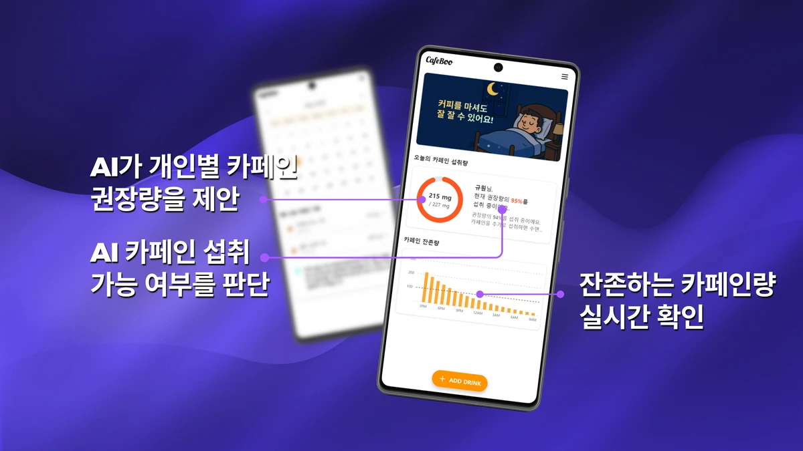
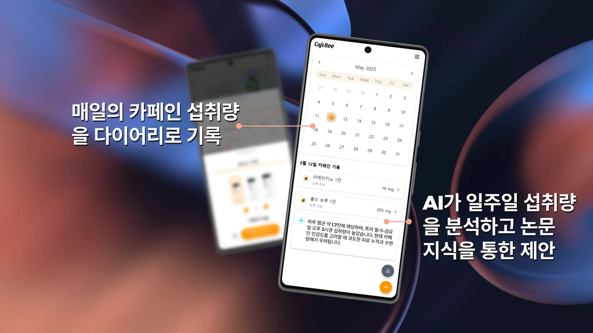

  
  

 

<section aria-labelledby="project-details">
  <h2 id="project-details">📌 Project Details</h2>
  
익명 기반의 자유로운 소통을 지향하는 웹 커뮤니티 서비스 프로젝트 

</section>

 

<section aria-labelledby="roles">
  <h2 id="roles">👨‍💻 My Roles &amp; Responsibilities</h2>
  <ul>
    <li> API Rate Limiter 도입을 통한 과도한 API 호출 방지 및 중복 데이터 생성 방지 </li>
    <li> Junit, Mockito, Jmeter를 이용한 테스트 구성 및 부하테스트 진행 </li>
    <li><u><strong>테스트 커버리지 70%</strong></u> 달성</li>
  </ul>
</section>

 

<section aria-labelledby="tech">
  <h2 id="tech">🛠️ Technologies</h2>
  <ul>
    <li>Java Spring Boot</li>
    <li>Vanilla JS</li>
    <li>MySQL</li>
  </ul>
</section>

 

<section aria-labelledby="troubleshooting">
  <h2 id="troubleshooting">Troubleshooting</h2>
  

    프로젝트 설계 및 트러블 슈팅 기록은 [여기에](https://silky-ring-ac3.notion.site/1e2b7198b66480a58cc1f30845cb9cee?source=copy_link) 기록했습니다.
  

</section>

 

<section aria-labelledby="key-features">
  <h2 id="key-features">🚀 Key Features</h2>

  <article aria-labelledby="web-user">
    <h3 id="caffeine-add">🔹 회원가입 및 유저 정보 수정, 탈퇴 기능 </h3>
    
 유저 정보에 대한 CRUD 기능 구현 

  </article>
  
   
  

   
  
  <article aria-labelledby="web-post">
    <h3 id="caffeine-add">🔹 게시물 등록 및 수정, 삭제 기능 </h3>
    
 유저가 작성하는 게시글에 대한 CRUD 기능 구현 

  </article>

   
  

   
  
  <article aria-labelledby="web-comment">
    <h3 id="caffeine-management">🔹 댓글 등록 및 수정, 삭제 기능 </h3>
    
유저가 작성하는 댓글에 대한 CRUD 기능 구현

  </article>
  
   
  

   
  
  <article aria-labelledby="web-like">
    <h3 id="feature-realtime">🔹 좋아요 기능</h3>
    
서비스에 등록된 게시물들에 대해 좋아요 기능 제공

  </article>
  
   
  

   
  
</section>
